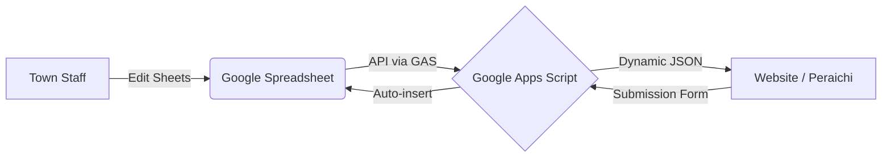

# Project Overview: りんごのまちいいづな (Iizuna Apple Portal)

This document describes the system architecture and the rich frontend features of the Iizuna Apple Portal site, designed to facilitate communication between the town and its residents/visitors.

## 🌟 Core Concept: "Spreadsheet as a CMS"
The entire website is driven by Google Sheets. This allows non-engineers (town staff, operators) to update the website content, categories, and keyword links without touching a single line of code.

---

## 🖥️ Key Frontend Features

The frontend is built to be "Rich & Responsive," providing a native-app-like experience within a web browser.

### 1. Multi-Functional Modal System (`modal.js`)
When a user clicks on an article card, a sophisticated modal appears with several advanced features:
- **Real-time Translation**: Switch between Japanese, English, and Chinese instantly.
- **Smart Image Gallery**: Handles multiple high-quality images with an interactive thumbnail system.
- **PDF Export**: Generates a professional A4 PDF flyer of the article on-the-fly, including a QR code back to the digital page.
- **SNS Integration**: Customized sharing blocks with localized suggested text and hashtags.
- **Dynamic Info Tables**: Automatically formats business hours, period dates, fees, and contact info based on the entry type (Shop, Event, Farmer, etc.).
- **Interactive Maps**: Embeds localized Google Maps accurately based on the spreadsheet data.

### 2. Intelligent Search Engine (`modal-search.js`)
A powerful, category-aware search engine that works inside the modal:
- **Keyword Autolinking**: The system scans article texts for specific keywords (defined in the spreadsheet) and automatically converts them into green "Search Links" or red "Direct Links."
- **Visual Search Results**: Results include category badges, thumbnails, and highlighted text snippets for quick scanning.
- **Integrated Experience**: Users can jump between related articles and search results without closing the main modal window.

### 3. Highly Granular Submission Form (`Form/`)
The portal includes a professional-grade information submission system:
- **Smart Templates**: The form fields change dynamically based on the type of submission (e.g., "Event" asks for dates, "Shop" asks for business hours).
- **Multilingual UI**: Fully translated labels and placeholders to support international visitors and developers.
- **Direct-to-Sheets**: Submissions are instantly validated and inserted into the spreadsheet, notifying managers for review.

---

## 📂 Project Structure for Teams

| File / Directory | Role | Team Responsibility |
| :--- | :--- | :--- |
| `web/` | Core Frontend Logic | UI/UX Developers (CSS/JS) |
| `Form/` | Submission Logic | Integration Developers |
| `Import/` | GAS Logic (Backend) | Backend Engineers / GAS Devs |
| `Analytics/` | Analytics Logic | Data Analysts |
| **Spreadsheet** | Database / Content | **Operators / Content Managers** |

### How to update content?
1. **Change Text**: Simply edit the `body` or `title` columns in the spreadsheet. The website reflects changes on the next refresh (or via Cache clear).
2. **Add Search Keywords**: Add a row to the `キーワード` sheet. The website will automatically underline that word in all articles and link it to a search query.
3. **Change Categories**: Update the `カテゴリ` sheet. The search filters and submission form dropdowns will update automatically.

---

Created & Maintained by the Iizuna Apple Project Team.
