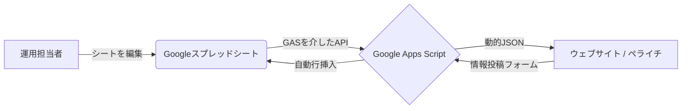

# プロジェクト概要: りんごのまちいいづな (飯綱町産りんごポータル)

このドキュメントでは、システムの全体設計と、町民や訪問者とのコミュニケーションを促進するために設計されたリッチなフロントエンド機能について説明します。

## 🌟 コアコンセプト: 「スプレッドシートをCMSとして活用」
ウェブサイト全体のデータはGoogleスプレッドシートで管理されています。これにより、エンジニア以外の担当者（町職員、運用チーム）が、コードを一行も書かずにコンテンツ、カテゴリー、キーワードリンクを更新できるようになっています。

---

## 🖥️ 主要なフロントエンド機能

フロントエンドは「リッチ＆レスポンシブ」を掲げ、ブラウザ上でネイティブアプリのような体験を提供します。

### 1. 多機能モーダルシステム (`modal.js`)
記事カードをクリックすると、高度な機能を備えたモーダルが表示されます：
- **リアルタイム多言語切り替え**: 日本語、英語、中国語を瞬時に切り替え可能。
- **スマート画像ギャラリー**: 複数の高画質画像をインタラクティブなサムネイル形式で表示。
- **PDFチラシ生成**: 記事の内容をその場でプロフェッショナルなA4チラシ（PDF）として生成。デジタル版へのQRコードも自動付与されます。
- **SNS連携・共有**: 言語ごとに最適化された紹介文とハッシュタグを含む共有ブロック。
- **動的情報テーブル**: 投稿タイプ（店舗、イベント、生産者など）に応じて、営業時間、開催期間、参加費、連絡先などを自動で整形表示。
- **インタラクティブマップ**: スプレッドシートの住所データに基づき、正確なGoogleマップを埋め込み表示。

### 2. インテリジェント検索エンジン (`modal-search.js`)
モーダル内で動作する、カテゴリーを考慮した強力な検索エンジンです：
- **キーワード自動リンク**: 記事内のテキストをスキャンし、スプレッドシートで定義されたキーワードを自動的に「検索リンク（緑）」や「直接リンク（赤）」に変換します。
- **ビジュアル検索結果**: 検索結果にはカテゴリーバッジ、サムネイル、ハイライトされたテキストスニペットが含まれ、素早い情報確認を助けます。
- **シームレスな体験**: モーダルを閉じずに、関連記事や検索結果の間を自由に移動できます。

### 3. 高機能な情報投稿フォーム (`Form/`)
プロフェッショナル仕様の情報収集システムを搭載しています：
- **動的フィールド構成**: 投稿タイプ（例：「イベント」なら開催日、「店舗」なら営業時間）に合わせて入力項目が自動で変化します。
- **多言語UI**: 開発者や国際的な訪問者を支援するため、ラベルやプレースホルダーも完全に多言語化。
- **スプレッドシートへの直接書き込み**: 投稿内容は即座にバリデーション（検証）され、スプレッドシートに挿入されます。

### 4. 高度なアクセス分析システム (`Analytics/`)
単なるPV計測に留まらず、ユーザーの「興味の遷移」を高度に可視化します：
- **[Web版ダッシュボード](https://script.google.com/macros/s/AKfycbwhDC_w7tJVv5qb9YPsQbeZg7F7DSZKjaIt2A5x7_dGK41y95MJa5o1H4xN79JCMydYkQ/exec?mode=dashboard)**: パラメータを正規化したページ別集計に加え、個別モーダル（むーちゃん等の記事）の人気度を階層別に分析可能。
- **流入・離脱の可視化**: どの外部サイトから来たか（Referrer）や、どの外部リンクをクリックして離脱したか（Exit Link）を新たに計測。
- **キーワードジャーニー追跡**: 検索フォームからの入力と、記事内キーワードクリックを完全に統合。トップページ（ドメインのみ）へのアクセスも `/` として正確に合算されます。
- **完全日本語化**: 運用チームが迷わず利用できるよう、管理画面の全項目を日本語化。
- **スプレッドシート連動**: 解析結果はスプレッドシート内の「📊 Dashboard」シートにも自動集計されます。

---

## 📂 チーム向けプロジェクト構造

| ファイル / ディレクトリ | 役割 | 担当チーム |
| :--- | :--- | :--- |
| `web/` | フロントエンドのコアロジック | UI/UXエンジニア (CSS/JS) |
| `Form/` | 情報投稿フォームのロジック | 統合開発者 |
| `Import/` | GASロジック (バックエンド) | バックエンド / GAS開発者 |
| `Analytics/` | 分析ロジック & [管理画面](https://script.google.com/macros/s/AKfycbyKEcxjhF3oauzrZB1hxYbl9a4w1FAq9vzktVP5FDMcmnIWuvN_U3zzlCzJ9dKMAnhsQg/exec?mode=dashboard) | データアナリスト |
| **スプレッドシート** | データベース / コンテンツ | **運用・コンテンツ管理担当** |

### コンテンツを更新するには？
1. **テキストの変更**: スプレッドシートの `body` や `title` 列を編集するだけです。次回の読み込み時に反映されます。
2. **検索キーワードの追加**: `キーワード` シートに行を追加します。サイト内の全記事でその単語が自動的にリンク化されます。
3. **カテゴリーの変更**: `カテゴリ` シートを更新します。検索フィルターや投稿フォームの選択肢が自動で同期されます。

---

飯綱町産りんごプロジェクトチームによって作成・維持されています。
